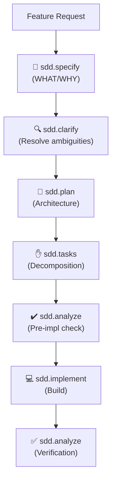

# ARCUS: Context-Aware Spec Driven Development for LLM Agents


**ARCUS** (**A**ny **R**epository **C**an **U**se **S**DD) is a framework for building with LLM agents reliably.

It gates implementation behind a structured pipeline of verified artifacts:
```
Feature description → spec.md → plan.md → tasks.md → implementation
```

Each stage validates its output. No stage proceeds until the previous one passes. The result is traceable, auditable, and hallucination-resistant.

---

## Quick Start

### For the impatient:

See [Integration Guide](ARCUS_INTEGRATION_GUIDE.md) for setup, CLI commands, and integration workflow.

### For context, read:

- **[Philosophy](docs/philosophy.md)** — Why process beats prompting (5 min read)
- **[Architecture](docs/architecture.md)** — How ARCUS works (10 min read)

---

## Why ARCUS Matters

LLM-powered coding agents are remarkably capable — but without structure, they tend to:

- **Infer requirements** instead of following specifications
- **Make architectural decisions** without design review
- **Load excessive context**, wasting tokens and introducing noise
- **Produce inconsistent output** across runs and team members
- **Leave no decision trail** for auditability
- **Drift from intent** as repositories evolve

The root cause isn't model capability. **It's the absence of process and context awareness.**

ARCUS solves this through:
- Specification-driven gating (what is built is what was specified)
- Repository context hierarchy (focused, not full-scan)
- Quality gates (no artifact proceeds without validation)
- Deterministic workflows (same input → same output → team alignment)

---

## Core Concepts

ARCUS solves three problems that vague agent prompts cannot:

| Problem | Solution |
|---------|----------|
| **Hallucination in implementation** | Agents implement from tasks.md, which is derived from spec → plan. The chain is traceable. |
| **Context bloat and token waste** | Context hierarchy: shared context (built once) + story-specific context-pack (300-800 tokens). Not full codebase scans. |
| **No audit trail** | Every artifact has metadata, lineage, and verification commits. Full chain from requirement to code is recoverable. |

---

## The Workflow

**Phase A: Bootstrap** (once per repository)
- Analyze your repository
- Generate `.context/` (business scope, technical topology, flows, testing patterns)
- Create copilot guardrails

**Phase B: Feature Development** (repeat per story)
1. **Specify** (WHAT/WHY) — Generate spec.md with requirements and user stories
2. **Clarify** (optional) — Resolve ambiguities with targeted questions
3. **Plan** (HOW) — Generate plan.md with architecture and phases
4. **Tasks** (WHO/WHAT/WHEN) — Break down into dependency-ordered tasks
5. **Analyze (pre-impl)** — Quality check before implementation
6. **Implement** — Execute tasks, guided by spec and plan
7. **Analyze (post-impl)** — Verify completeness, detect context drift

Each stage produces an artifact. Each artifact is validated by quality gates.

**Visual workflow:**



See [SDD Workflow](docs/sdd-workflow.md) for full pipeline details and architecture diagrams.

---

## Documentation

| Document | Purpose |
|----------|---------|
| **[Philosophy](docs/philosophy.md)** | Why ARCUS exists: vibe coding problems, why SDD matters |
| **[Context System](docs/context-system.md)** | How context engineering works (ARCUS's differentiator) |
| **[Architecture](docs/architecture.md)** | Design decisions: agents, skills, gates, verification commits |
| **[Skills and Agents](docs/skills-and-agents.md)** | How to extend ARCUS, add skills, customize |
| **[Quality Gates](docs/quality-gates.md)** | How structural validation works, gate profiles |
| **[SDD Workflow](docs/sdd-workflow.md)** | Full pipeline diagram and stage descriptions |
| **[Glossary](docs/glossary.md)** | Definitions of ARCUS terminology |

---

## The Self-Hosting Principle

ARCUS is now using ARCUS to evolve. New features to the framework are developed with the same context awareness framework that target repositories use. This is the strongest test of validity: if ARCUS cannot describe its own development, it is not production-grade. However, this is a WIP and the framework is still evolving. With agents, you can never be 100% sure ;)

---


## Reference

- [Integration Guide](ARCUS_INTEGRATION_GUIDE.md) — Setup, CLI usage, and integration workflow
- [Agent Registry](registry/AGENT_REGISTRY.md) — Complete agent catalog
- [Skill Registry](registry/SKILLS_REGISTRY.md) — Complete skill catalog
- [Engineering Guidelines](guidelines/engineering/engineering-guidelines.md) — Code quality standards
- [Architecture Guidelines](guidelines/architecture/architecture-guidelines.md) — System design principles
- [Testing Standards](guidelines/testing/testing-guidelines.md) — Testing best practices

---

## License

ARCUS is licensed under the MIT License. See [LICENSE](LICENSE) for details.

ARCUS extends and builds upon the Spec Driven Development methodology pioneered by [GitHub Spec-Kit](https://github.com/github/spec-kit), also under MIT license.

---

## Contributing

This repository has restricted collaboration (no public PRs). For inquiries or feedback, please reach out via GitHub Discussions.

---

Last updated: 2026-05-07  
ARCUS Version: 0.8.0 (beta)
